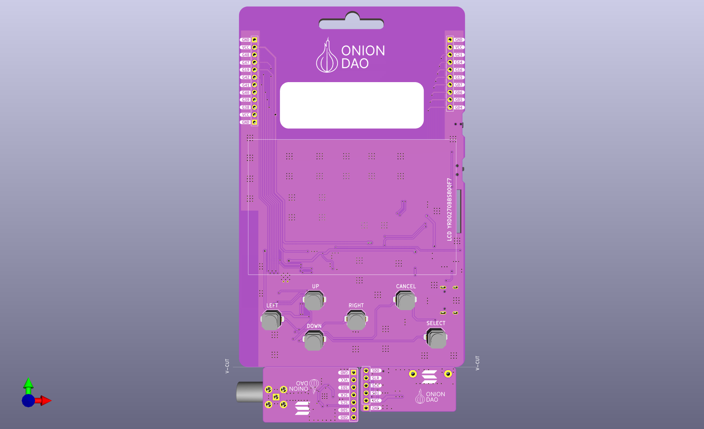
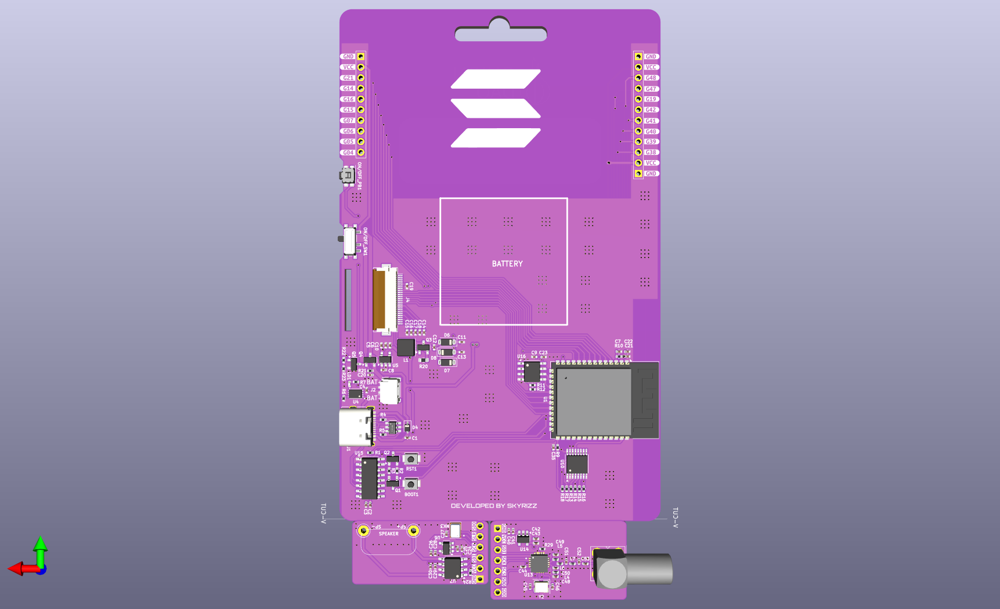

# OnionDAO Badge

An open-source, hacker-conference-style electronic badge built around the
**ESP32-S3-WROOM-1-N8R8** (8 MB flash + 8 MB Octal PSRAM), with swappable
RF / audio / storage modules, an e-paper
(or TFT) display socket, a secure element, an I²C IO expander for the button
matrix, and dual side-mounted expansion ports for hardware mods.

Designed in **KiCad 9.0.3**. The hardware (schematics, PCB, BOM, fabrication
outputs, STEP model) lives in [`pcb/`](pcb). The software lives in
[`software/`](software) and is community-driven — PRs welcome.




---

## Table of Contents

- [At a Glance](#at-a-glance)
- [Block Diagram](#block-diagram)
- [Repository Layout](#repository-layout)
- [Hardware Documentation](#hardware-documentation)
- [Quick Start (Software)](#quick-start-software)
- [Pinout Cheat Sheet](#pinout-cheat-sheet)
- [Contributing Software Mods & Guides](#contributing-software-mods--guides)
- [License](#license)

---

## At a Glance

| | |
|---|---|
| **MCU** | Espressif **ESP32-S3-WROOM-1-N8R8** (Wi-Fi + BT 5.0 LE, dual-core Xtensa LX7) |
| **Memory** | 8 MB quad-SPI flash (`N8`) + 8 MB **Octal-SPI (OPI)** PSRAM (`R8`) |
| **USB / Serial** | WCH **CH340C** USB-UART bridge w/ DTR/RTS auto-reset |
| **Secure Element** | Microchip **ATECC608B-SSHDA** (I²C, power-gated) |
| **IO Expander** | TI **TCA9534** (I²C, addr `0x20`) driving the 6-button matrix (PB1–PB6) |
| **Display** | 24-pin socket (`J4`) — E-Ink / TFT SPI with `BUSY`, `RST`, `DC`, `CS`, `SCK`, `MOSI` |
| **Audio (mod)** | NS4168 I²S amplifier + SPH0641 PDM mic (Sound Module) |
| **Sub-GHz (mod)** | TI **CC1101** SPI radio (315/433/868/915 MHz) |
| **Expansion** | Left port `J8` (10 pin) + Right port `J10` (10 pin) — VCC / GND + GPIO |
| **GPIO Used** | 28 of the available ESP32-S3 GPIOs |
| **Power Gate** | Q5 (SS8050) on `GPIO18` enables the peripheral `PWR` rail |

## Block Diagram

```
                              ┌────────────────────────┐
        USB-C ── CH340C ──────│ UART0  GPIO43/44       │
                              │                        │
   ┌── BOOT btn ── GPIO0 ─────│ STRAP                  │
   │                          │                        │
   │   ATECC608B ──┬─ SCL G9 ─│ I²C0                   │
   │   TCA9534  ──┘  SDA G10  │   ◄── INT G1 (PBINT)   │
   │                          │                        │
   │   J4 Display ─SPI──── G11/12/13/14/17/21          │
   │                          │                        │
   │   J8 Left   ── G48/47/19/42/41/40                  │  ESP32-S3-WROOM-1
   │   J10 Right ── G38/39/16/15/7/6/5/4                │
   │                          │                        │
   │   GPIO18 ──── Q5 ────────│ PWR rail to gated peripherals
   │   GPIO8  ──── SE_EN  ────│ ATECC608B power gate
   │                          └────────────────────────┘
   │
   └── PB1..PB6 ── TCA9534 P0..P5 ──► INT line ── GPIO1
```

## Repository Layout

```
oniondao-badge/
├── README.md                   ← you are here
├── pcb/                        ← KiCad 9.0.3 hardware sources
│   ├── oniondao-badge.kicad_pro
│   ├── oniondao-badge.kicad_sch         (top-level schematic)
│   ├── oniondao-badge.kicad_pcb         (board layout)
│   ├── CC1101_MOD.kicad_sch              (Sub-GHz RF module)
│   ├── SOUND_MOD.kicad_sch               (I²S amp + PDM mic)
│   ├── oniondao-badge.step              (full 3D model)
│   ├── 3d/                               (additional STEP assets)
│   ├── production/                       (gerbers, BOMs, netlist)
│   ├── oniondao-badge_top.png           (board render — top)
│   ├── oniondao-badge_btm.png           (board render — bottom)
│   └── oniondao badge.html                   (interactive IO reference)
├── docs/
│   ├── HARDWARE.md             ← deep dive on every subsystem
│   ├── PINOUT.md               ← full GPIO ↔ net ↔ peripheral table
│   ├── MODULES.md              ← swappable modules & their pinmaps
│   └── CONTRIBUTING.md         ← how to PR a mod / guide / example
└── software/
    ├── README.md
    ├── examples/               ← minimal, single-feature firmware
    ├── guides/                 ← end-to-end how-tos
    └── mods/                   ← community firmware mods & forks
```

> **Tip:** open [`pcb/oniondao badge.html`](pcb/oniondao%20badge.html) in a browser for
> a colour-coded, searchable, filterable view of the IO table. It is the
> source of truth that [`docs/PINOUT.md`](docs/PINOUT.md) mirrors in markdown.

## Hardware Documentation

The docs are split so you can read just what you need:

- **[docs/HARDWARE.md](docs/HARDWARE.md)** — overview of every subsystem on
  the board: power, USB/UART, boot circuit, I²C bus, display socket, secure
  element, button matrix, expansion ports.
- **[docs/PINOUT.md](docs/PINOUT.md)** — the complete GPIO map: every used
  pin, its net, direction, interface, and the peripheral it connects to.
- **[docs/MODULES.md](docs/MODULES.md)** — the swappable modules
  (CC1101 / Sound) and the shared-GPIO assignments. Read
  this **first** if you are writing firmware that touches the side ports.

### Manufacturing

- Gerbers, drill files, and pick-and-place are zipped in
  [`pcb/production/oniondao-badge.zip`](pcb/production/oniondao-badge.zip).
- BOMs per variant: `bom-list_cc1101.xlsx`, `bom-list_sound.xlsx`,
  `bom-list_lanyard_new.xlsx`.
- IPC-D-356 netlist: `pcb/production/netlist.ipc`.

## Quick Start (Software)

The badge enumerates as a standard CH340 serial port, so any ESP32-S3 toolchain
works at the hardware level — **ESP-IDF**, **Arduino-ESP32**, **PlatformIO**,
**MicroPython**, **CircuitPython**.

> **Building the firmware in this repo?** The projects under `software/` are
> **ESP-IDF v5.5.x** projects (with the Arduino core as a component). Follow the
> step-by-step **[VS Code + ESP-IDF setup guide](software/guides/esp-idf-vscode-setup.md)**
> to install the toolchain and flash a badge.

### Memory configuration (N8R8)

The populated module is an **ESP32-S3-WROOM-1-N8R8**: 8 MB flash + 8 MB PSRAM
in **Octal (OPI)** mode. PSRAM will not initialise unless you select Octal
mode explicitly — quad-mode defaults silently disable it. Set per toolchain:

| Toolchain | Flash | PSRAM |
|-----------|-------|-------|
| **ESP-IDF** (`sdkconfig`) | `CONFIG_ESPTOOLPY_FLASHSIZE_8MB=y` | `CONFIG_SPIRAM=y`, `CONFIG_SPIRAM_MODE_OCT=y`, `CONFIG_SPIRAM_SPEED_80M=y` |
| **Arduino-ESP32** (boards menu) | `Flash Size = 8MB` | `PSRAM = OPI PSRAM` |
| **PlatformIO** | `board_build.flash_size = 8MB` | `board_build.arduino.memory_type = qio_opi` + `-DBOARD_HAS_PSRAM` |

The firmware projects under [`software/`](software) already carry these settings
in their `sdkconfig.defaults` — see the
[VS Code + ESP-IDF setup guide](software/guides/esp-idf-vscode-setup.md).

### Programming

1. Plug in USB-C. The CH340C + DTR/RTS auto-reset circuit (Q1/Q2 on
   `GPIO0`/`EN`) means **you do not need to hold BOOT** — the toolchain
   strobes it for you.
2. If auto-reset ever fails: hold **BOOT** (the SW button tied to `GPIO0`),
   tap **RESET**, release **BOOT**, then flash.

### Minimal Arduino example

```cpp
// Blink the peripheral power rail and read the BOOT button.
#define PWR_EN   18    // Q5 base — enables peripheral VCC
#define BOOT_BTN 0     // strapping pin, doubles as user button after boot

void setup() {
  Serial.begin(115200);          // CH340C on UART0 (GPIO43/44)
  pinMode(PWR_EN, OUTPUT);
  pinMode(BOOT_BTN, INPUT_PULLUP);
  digitalWrite(PWR_EN, HIGH);    // power-up peripherals
}

void loop() {
  Serial.printf("BOOT btn: %d\n", digitalRead(BOOT_BTN));
  delay(250);
}
```

### Reading the 6 user buttons

The PB1–PB6 buttons are wired to the **TCA9534** IO expander (I²C
addr `0x20`), not directly to the ESP32. A button press pulls `PBINT`
(`GPIO1`) low; read the expander register over I²C to find which one.

```cpp
#include <Wire.h>
#define SCL_PIN 9
#define SDA_PIN 10
#define PBINT   1
#define TCA9534 0x20

void buttonISR();

void setup() {
  Wire.begin(SDA_PIN, SCL_PIN, 400000);   // I²C Fast Mode
  pinMode(PBINT, INPUT_PULLUP);
  attachInterrupt(PBINT, buttonISR, FALLING);
}

void buttonISR() {
  Wire.beginTransmission(TCA9534);
  Wire.write(0x00);                       // Input port register
  Wire.endTransmission(false);
  Wire.requestFrom(TCA9534, 1);
  uint8_t state = Wire.read();            // bit N low = PB(N+1) pressed
  // ... dispatch on `state`
}
```

See [`software/examples/`](software/examples) for working firmware
covering display, audio, RF, and the secure element.

## Pinout Cheat Sheet

Source of truth: [`pcb/oniondao badge.html`](pcb/oniondao%20badge.html) — open it in
a browser for the filterable view. The markdown mirror is
[`docs/PINOUT.md`](docs/PINOUT.md).

### Core / UART / Boot

| GPIO | Net | Dir | Peripheral | Notes |
|------|-----|-----|------------|-------|
| `GPIO0`  | `IO0` | IN  | BOOT button + auto-reset Q1/Q2 | **Strapping** — LOW at power-on → download mode |
| `GPIO43` | `TX0` | OUT | CH340C RXD (via R1 220Ω) | UART0 TX |
| `GPIO44` | `RX0` | IN  | CH340C TXD | UART0 RX |
| `GPIO18` | `PWR` | OUT | Q5 SS8050 → peripheral VCC | HIGH = enable power gate |

### I²C Bus (Security Chip + IO Expander)

| GPIO | Net | Dir | Peripheral | Notes |
|------|-----|-----|------------|-------|
| `GPIO9`  | `SCL`   | OUT | TCA9534 + ATECC608B    | 400 kHz max (Fast Mode) |
| `GPIO10` | `SDA`   | I/O | TCA9534 + ATECC608B    | TCA9534 @ `0x20` |
| `GPIO1`  | `PBINT` | IN  | TCA9534 INT → PB1..PB6 | Active LOW, `attachInterrupt(FALLING)` |
| `GPIO8`  | `SE_EN` | OUT | ATECC608B enable       | HIGH = active — power-gate when idle |

### Display Socket J4 (E-Ink / TFT SPI)

| GPIO | Net | Dir | J4 Pin | Function |
|------|-----|-----|--------|----------|
| `GPIO14` | `RS`   | OUT | 3  | Display RESET — LOW ≥10 ms during init |
| `GPIO13` | `DC`   | OUT | 11 | Data / Command select (HIGH = data) |
| `GPIO12` | `CS`   | OUT | 12 | SPI Chip Select (active LOW) |
| `GPIO11` | `SCK`  | OUT | 13 | SPI Clock |
| `GPIO21` | `BUSY` | IN  | 9  | Busy — wait LOW before next refresh |
| `GPIO17` | `SDI`  | OUT | 23 | SPI MOSI |

### Expansion Ports

| Pin | Left (J8) | Right (J10) |
|-----|-----------|-------------|
| 1   | GND       | GND |
| 2   | VCC       | VCC |
| 3   | `GPIO48`  | `GPIO38` |
| 4   | `GPIO47`  | `GPIO39` |
| 5   | `GPIO19`  | `GPIO16` |
| 6   | `GPIO42`  | `GPIO15` |
| 7   | `GPIO41`  | `GPIO7`  |
| 8   | `GPIO40`  | `GPIO6`  |
| 9   | VCC       | `GPIO5`  |
| 10  | GND       | `GPIO4`  |

> **Heads-up:** the **Sound Module** and **CC1101 Module** both reuse the
> same set of side-port GPIOs. Only one module's firmware can drive those
> pins at a time. See [`docs/MODULES.md`](docs/MODULES.md) for the exact
> overlap and how to choose at compile time.

## Contributing Software Mods & Guides

We want this badge to be a **playground**. If you wrote a synth, a CC1101
replay tool, an OLED demo, a CTF challenge, a CircuitPython port — open a PR
into [`software/`](software).

1. Pick the right folder:
   - `software/examples/` — one feature, minimal code, no story.
   - `software/guides/` — step-by-step tutorials (markdown + code).
   - `software/mods/` — full firmware projects / forks / variants.
2. Add a folder named after your mod, with a `README.md` describing what it
   does, which GPIOs / modules it requires, and how to build & flash.
3. Open a PR. Use the template in `.github/PULL_REQUEST_TEMPLATE.md`.

Full guidelines: [`docs/CONTRIBUTING.md`](docs/CONTRIBUTING.md).

## License

Hardware sources (KiCad files under `pcb/`) are released under
**CERN-OHL-S v2** unless a file header states otherwise. Software in
`software/` defaults to **MIT** — individual mods may override in their own
folder's `LICENSE` file.
